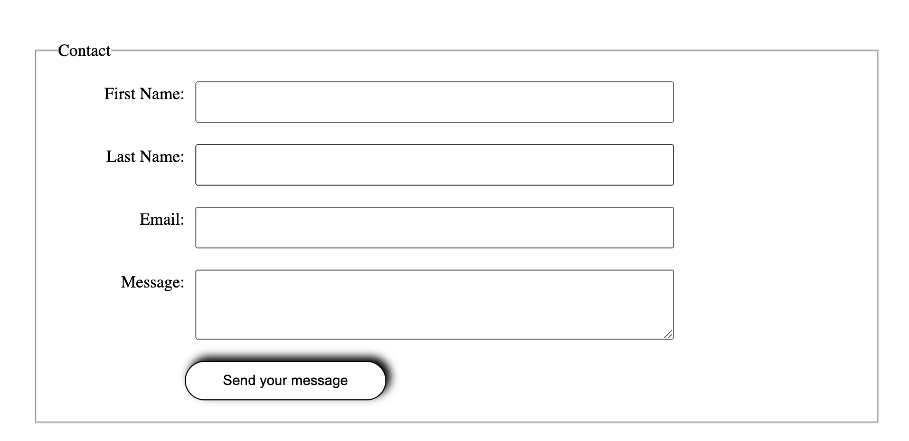

# Simple Form

This is a simple and responsive HTML form styled with CSS. It includes basic input fields such as name, email, and message, and is designed to be clean, minimal, and user-friendly.

## 🧾 Features

- Basic HTML form structure
- CSS styling for layout and responsiveness
- Placeholder text for guidance
- Focus and hover effects for better user experience

## 🖼️ Preview

 

## 🚀 Getting Started

To use or modify this project locally:

### 1. Clone the Repository

```bash
git https://github.com/akuutsang/Basic-form.git
