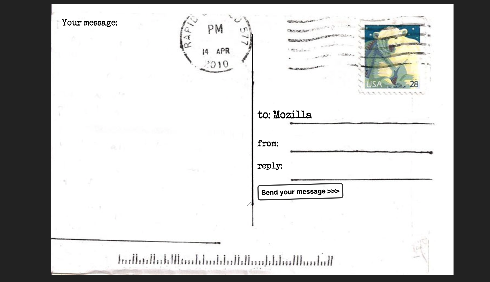

# Mozilla Form Assignment

This project is a simple web form created as part of the **Mozilla HTML/CSS Form Assignment**. It demonstrates fundamental concepts of form creation using semantic HTML and custom styling with CSS.

## 📄 Project Description



The form includes standard HTML form elements such as:

- Text input fields
- Email input field
- Submit button

All elements are styled using basic CSS to improve user experience and visual appeal.

## 🧰 Technologies Used

- **HTML5** for structure
- **CSS3** for styling

## 🧪 Features

- Semantic and accessible HTML form structure
- Labels properly associated with inputs
- CSS styling for layout and design
- Input placeholders and required field validation

## 🚀 Getting Started

To run this project locally:

1. Clone the repository:

```bash
git clone https://github.com/akuutsang/odin-projects
. Cd into postcard folder
```
